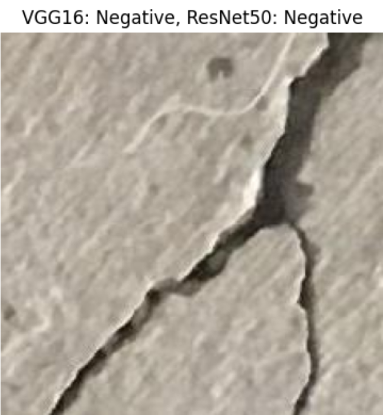
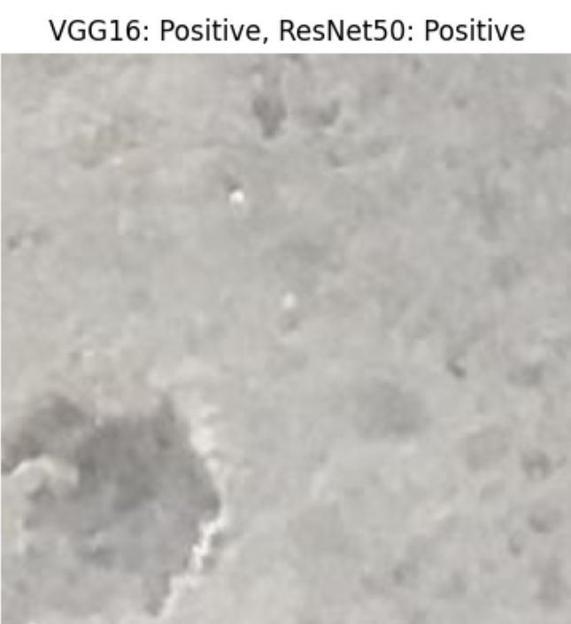

# Concrete Crack Detection Using Deep Learning

## Overview
Deep learning project comparing VGG16 and ResNet50 models for automated concrete crack detection. Includes model implementation, training, and performance evaluation scripts.

<p align="center">
  
  
</p>
<p align="center">
  <em>Figure: Examples of negative (left) and positive (right) concrete images used in the classification model.</em>
</p>

## Project Structure

- `vgg16_model.ipynb`: Jupyter notebook for implementing and training a VGG16-based model for concrete crack detection.
- `resnet50_model.ipynb`: Jupyter notebook for implementing and training a ResNet50-based model for concrete crack detection.
- `model_comparison.ipynb`: Jupyter notebook for comparing the performance of the VGG16 and ResNet50 models on a test dataset.

## Quick Start with Google Colab

Each notebook in this repository has been created and uploaded using Google Colab. You can run these notebooks directly in Colab without any local setup:

1. Click on the notebook you want to run (`.ipynb` file) in the GitHub repository.
2. Look for the "Open in Colab" button at the top of the file viewer.
3. Click the button to open the notebook in Google Colab.
4. Run the cells in the notebook sequentially.

This method allows you to run the code in the cloud, with GPU support, without needing to set up a local environment.

## Local Setup (Alternative)

If you prefer to run the notebooks locally:

1. Clone this repository:
   ```
   git clone https://github.com/yourusername/concrete-crack-detection.git
   ```
2. Install the required dependencies:
   ```
   pip install jupyter tensorflow keras matplotlib sklearn
   ```
3. Start Jupyter Notebook:
   ```
   jupyter notebook
   ```
4. Open and run the notebooks in order: `vgg16_model.ipynb`, `resnet50_model.ipynb`, `model_comparison.ipynb`

## Usage

1. Run all cells in `vgg16_model.ipynb` to train the VGG16 model.
2. Run all cells in `resnet50_model.ipynb` to train the ResNet50 model.
3. Run `model_comparison.ipynb` to compare the performance of both models.

## Dataset

The project uses a dataset of 40,000 concrete images, categorized into 'cracked' and 'non-cracked' classes. The dataset is automatically downloaded and extracted when running the training notebooks.

## Model Training

Models are trained within their respective notebooks. This allows you to observe the training process step-by-step and make modifications if needed.

## Results

The `model_comparison.ipynb` notebook provides a visual comparison of the VGG16 and ResNet50 models' performance on sample images from the test set.
